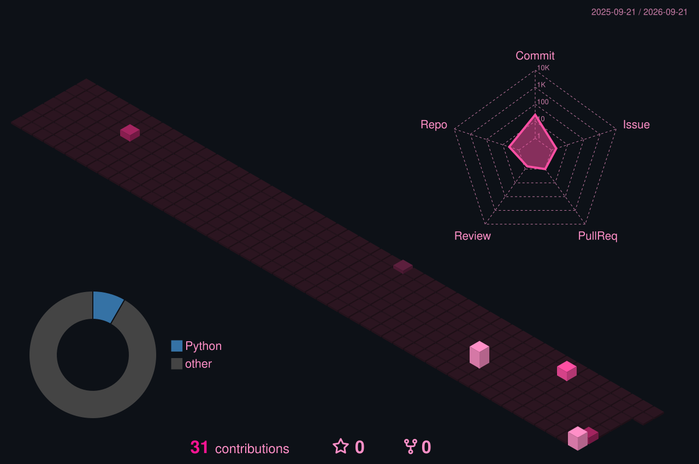

<!-- ═══════════════════ HEADER ═══════════════════ -->

 

---

<!-- ═══════════════════ ABOUT ═══════════════════ -->
##  &nbsp;whoami

Researcher and cybersecurity practitioner, certified in **SOC analysis, network security research, and penetration testing**. I build security tooling and find vulnerabilities *ethically* — then turn what I find into detection logic.

My research side lives in **machine learning for tabular and streaming data**: class imbalance, concept drift, explainability, and federated learning. My linguistics side lives in **low-resource NLP** — I maintain the first open dataset for **Mupun**, a left-behind West Chadic language of Nigeria.

I tinker with game dev occasionally. Mostly I'm here for NLP, exploit research, and ML-driven threat detection.

> Open to collaborating on penetration testing, threat detection, digital forensics, security tooling, and low-resource language work.

✨ mwah ✨

 

---

<!-- ═══════════════════ HIGHLIGHT ═══════════════════ -->
##  &nbsp;pinned work

<table>
<tr>
<td width="50%" valign="top">

### 🗣️ Mupun Language Resources
First open corpus for **Mupun**, a low-resource West Chadic language spoken in Plateau State, Nigeria. Built to make NLP possible for a language with near-zero digital footprint.

</td>
<td width="50%" valign="top">

### 🔬 Research Focus
Machine learning for **imbalanced**, **streaming**, and **distributed** data — with a bias toward methods that survive real deployment.

`class imbalance & resampling` · `concept drift detection`
`explainability (SHAP / LIME)` · `federated learning`
`meta-learning` · `ML for threat detection`

</td>
</tr>
</table>

### 🏅 Kaggle

---

<!-- ═══════════════════ CERTS ═══════════════════ -->
##  &nbsp;certifications

CEH / PenTest+ aligned

---

<!-- ═══════════════════ STACK ═══════════════════ -->
##  &nbsp;tech stack

**languages**

**machine learning & research**

**infrastructure & tooling**

**game dev & creative**

 

<b>⚔️ offensive & pentesting</b>

 

<b>🛡️ detection, monitoring & SIEM</b>

 

<b>🔍 digital forensics</b>

 

**spoken —** `English` · `Hausa` · `German` · `Japanese` · *and a few more, but this feels like enough*

---

<!-- ═══════════════════ 3D CALENDAR ═══════════════════ -->
##  &nbsp;stats

<!-- generated by .github/workflows/profile-3d.yml -->

 

  

  

<!-- pink contribution graph -->

 

<!-- pink snake — generated by .github/workflows/snake.yml -->

  

---

<!-- ═══════════════════ EXTRAS ═══════════════════ -->

### 🎧 on repeat

  

### 💭 random dev quote

 

### 🌸 outside the terminal

`🎤 singing` · `📚 reading` · `✍🏿 writing` · `🎧 podcasts` · `😒 complaining` · `🧵 sewing` · `🎨 drawing`

 

